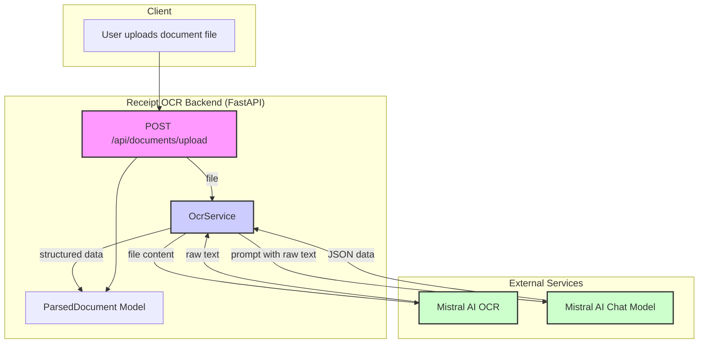

receiptocr-backend/
├── .env.example                # Example for environment variables
├── .gitignore
├── README.md
├── requirements.txt
├── tests/
│   ├── assets/                 # <-- Test images go here
│   │   ├── test_invoice.jpg
│   │   └── test_receipt.pdf
│   └── test_api.py             # Tests for your API endpoints
└── app/
    ├── __init__.py
    ├── api/
    │   ├── __init__.py
    │   ├── deps.py             # Dependencies for API endpoints
    │   ├── routers/
    │   │   ├── __init__.py
    │   │   ├── auth.py         # Auth endpoints (signup, login)
    │   │   └── receipts.py     # Receipt processing endpoints
    │   └── main.py             # Main router to include all sub-routers
    ├── core/
    │   ├── __init__.py
    │   └── config.py           # Centralized configuration
    ├── models/                 # Your existing models/schemas
    │   ├── __init__.py
    │   └── receipt.py
    ├── services/
    │   ├── __init__.py
    │   ├── ocr_service.py      # Refactored MistralOCR logic
    │   └── storage_service.py  # Logic for Supabase storage
    ├── main.py                 # Minimal application entry point
    └── exceptions.py           # Custom exceptions

---
## Architectural Overview

This project is a FastAPI backend designed to process uploaded receipt files (images or PDFs). It uses Mistral AI for both Optical Character Recognition (OCR) to extract text and a chat model to parse that text into structured JSON data.

### Data Flow

The data flow is as follows:
1. A user uploads a receipt file to the `/api/documents/upload` endpoint.
2. The `OcrService` handles the file.
3. It first calls the Mistral OCR API to extract raw text from the document.
4. This raw text is then sent to a Mistral chat model with a prompt instructing it to parse the text into a structured JSON format.
5. The resulting JSON is validated against a Pydantic model (`ParsedDocument`) and returned to the user.

### Diagram

